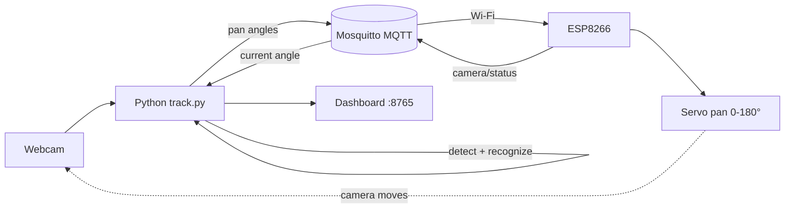
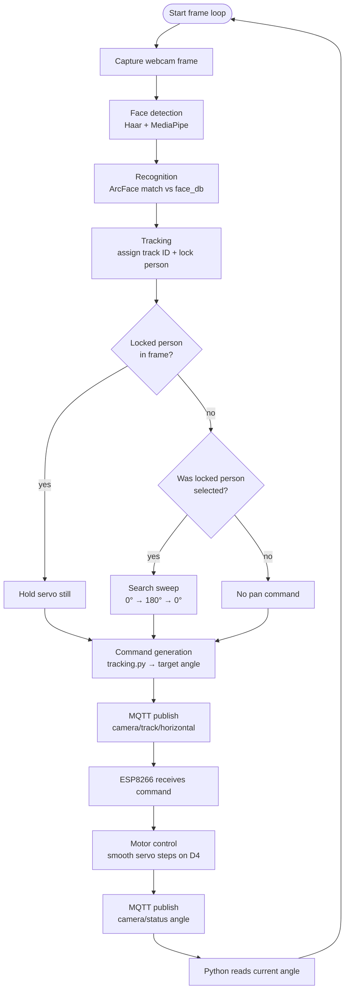

# FaceLocking — System Architecture

For setup and retries, see [HOW_TO_RUN.md](HOW_TO_RUN.md).

## Block diagram

Camera, AI processing, MQTT, ESP8266, and servo.

## Flowchart

Recognition → tracking → command generation → motor control.

**Start:** `start_all.bat` → sync IP → flash ESP → `track.py --dashboard`

**Lock behavior:** When a locked person is visible the servo holds. When they leave the frame the system searches until they reappear.
